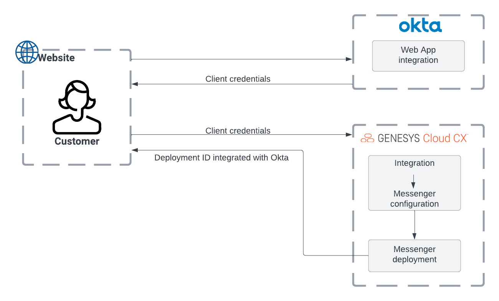

# Integrating OKTA with Messenger for SSO configuration

View the [Use OKTA Integration with Messenger for SSO configuration](https://github.com/GenesysCloudBlueprints/messenger-authentication-okta-integration-blueprint "[Use OKTA Integration with Messenger for SSO configuration"). 

This Genesys Cloud Developer Blueprint demonstrates how to integrate Web messenger with OKTA to perform SSO integration and steps to set up an OKTA account for authorization credentials.

You can view the complete blueprint and download the sample files from [here](https://github.com/GenesysCloudBlueprints/messenger-authentication-okta-integration-blueprint "Use OKTA Integration with Messenger for SSO configuration").

